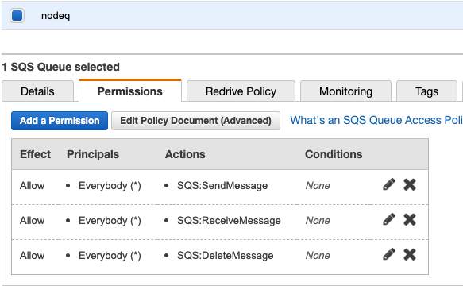
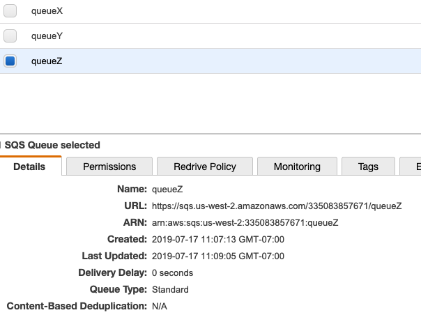

# Demo - Message Queues

## AWS SQS

## `sqs`

This demo contains 2 files, one for publishing, one for receiving messages from a queue.

* Ensure that your AWS credentials are installed on your machine and add if not
  * `aws configure`
* The demo and participation sections for lab require that you have your credentials
* To get setup, first, create an SQS queue in the AWS console
* Give it wide open permissions
  * Everyone (*)
  * Read, Send, Delete
  
  

* In your terminal use `npm i` to install the dependencies
* Edit both of the files (`sqs-send.js`, `sqs-receive.js`)
  * Change the `arn` for the queue to point to the queue you created above
  * Change the messages if you desire 
 
 Once you're all setup, open up 2 terminal windows.
 
 1. Run `node sqs-receive.js`  This will "listen" for queued events
 1. Run `node sql-send.js`  This will send a new random event every .5 seconds
 1. Watch in amazement as your messages appear in the receiver window
 1. Now, we talk about scale ...
 1. Open a second terminal window and run `node sqs-receive` in that one
 1. You should see about 50% of the requests now going to each window.
 1. Imagine a world where you have 100,000,000 receivers (this is AWS scale)
 
 For the final part of the demo, invite others to run the `sqs-receive.js` on their machines.  If they have credentials, this should work nicely, and you'll see the 'send' load now being distributed amongst all the class.  
 
 As they 'pop-in' and 'pop-out',  you can see the other machines bearing more/less of the overall messaging load. This is a good small-scale peek at how actual scale works.
 
 

