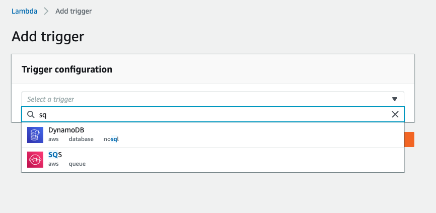
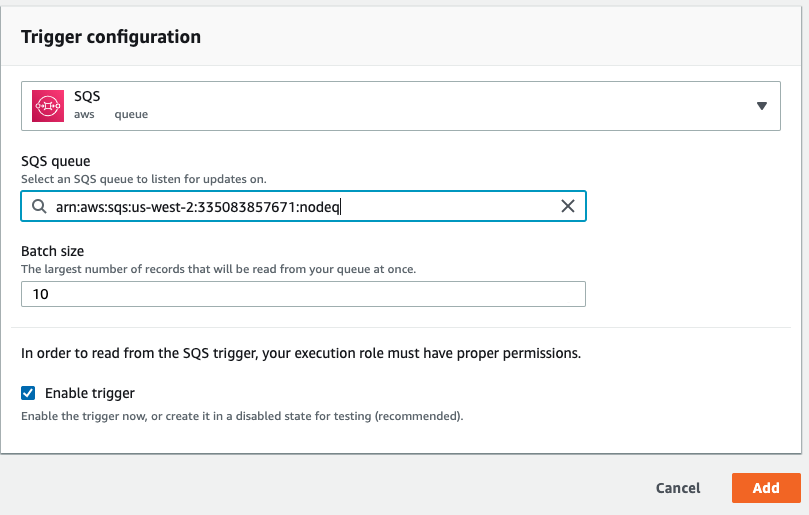

# SQS & Lambda

Student facing document describing this class day

## Learning Objectives

* Describe and Define  
  * The process of connecting a Lambda function to an SQS Queue
  * Handling Queued Messages in a Lambda Function
* Execute
  * Connect a Function to a Queue
  * Handle a Queued Message

## Daily Overview

* Using an SQS Queue fully in the cloud
* Issues of Scale

## Connecting Queues and Functions

You connect a function to a Queue, not the other way around. Remember - Queues are polled by subscribers, they do not PUSH.

* Create a Lambda Function
* Open the "Designer" Tab
* Add a new trigger and choose `SQS`

  

* Once chosen, find your SQS Queue and set your base options

  


### Lambda SQL Handler Code (JS)

The `event` object will contain an array of `Records[]`, each of which is a message. The `Body` of message is where you'll find the meat of the operation, and is what your Lambda function will operate on.

This example shows looping through `Records` -- SQS will batch send records to your function, so be ready do deal with that array of messages.

```javascript
exports.handler = async (event) => {
    for (const { messageId, body } of event.Records) {
        console.log('SQS message %s: %j', messageId, body);
    }
    return `Successfully processed ${event.Records.length} messages.`;
};
```

