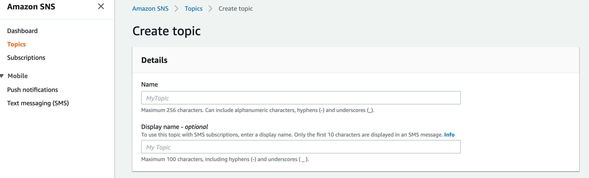
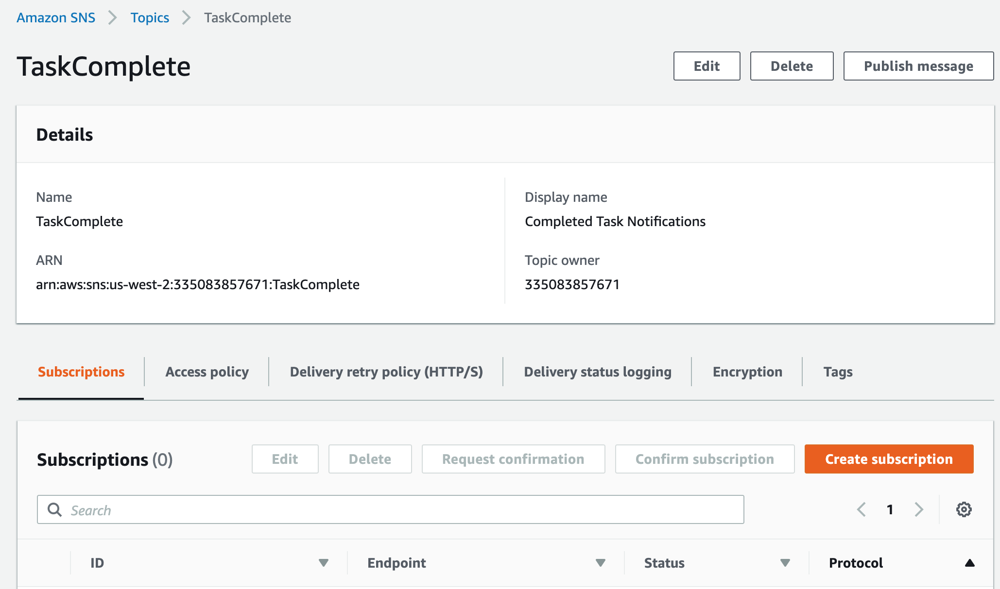
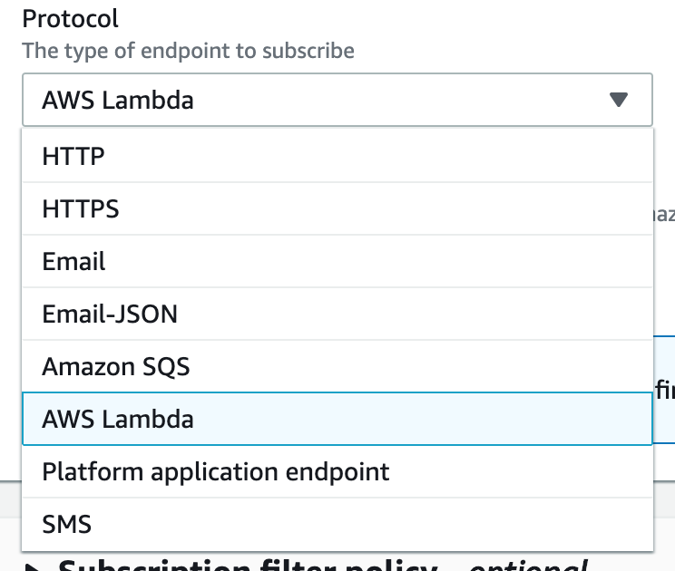
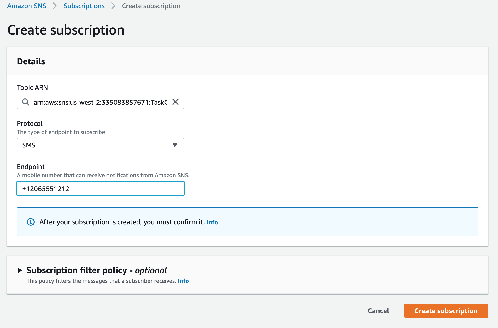
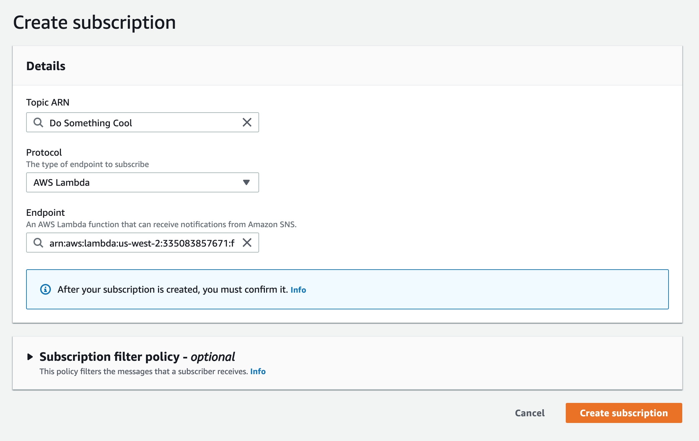

# Notification Services (SNS)

Simple Notification Service

## Learning Objectives

* Describe and Define  
  * The differences between SNS and SQS
  * Use Cases for Notifications
* Execute
  * Setup multiple SNS Topics
    * Email
    * SMS
    * Lambda
  * Send a notification to a topic 

## Daily Overview

## SNS Setup

The process of settings up SNS is fairly straightforward. You begin first by creating a new topic, which is as simple as giving it a name and a description





Once you have a topic created, you can manually create "subscriptions" to it. These are pointed services that SNS will **push** notifications to whenever the topic receives a message.

Generally, Subscribers are Amazon Services such as Lambda or SQS ... or external notifications such as SMS or Email

**Subscription Types**



**SMS Subscriber** (Note the +1... format on the phone number!)



**Lambda Function Subscriber**



### Sample JS Subscribe
```
const AWS = require('aws-sdk');
AWS.config.update({region: 'us-west-2'});
const sns = new AWS.SNS();

var params = {
  Protocol: 'sms',
  TopicArn: 'arn:aws:sns:us-west-2:335083857671:TaskComplete',
  Endpoint: '+12062764309',
  ReturnSubscriptionArn: true || false,
};

sns.subscribe(params).promise()
  .then( data => console.log('OK', data) )
  .catch( console.error );
```


### Sample JS Publishing
```
const AWS = require('aws-sdk');
AWS.config.update({region: 'us-west-2'});

var sns = new AWS.SNS();
const params = {
  Message: 'Hey there, John!',
  TopicArn: 'arn:aws:sns:us-west-2:335083857671:TaskComplete',
};
sns.publish(params).promise()
  .then( data => console.log(data) )
  .catch(console.error);
```
